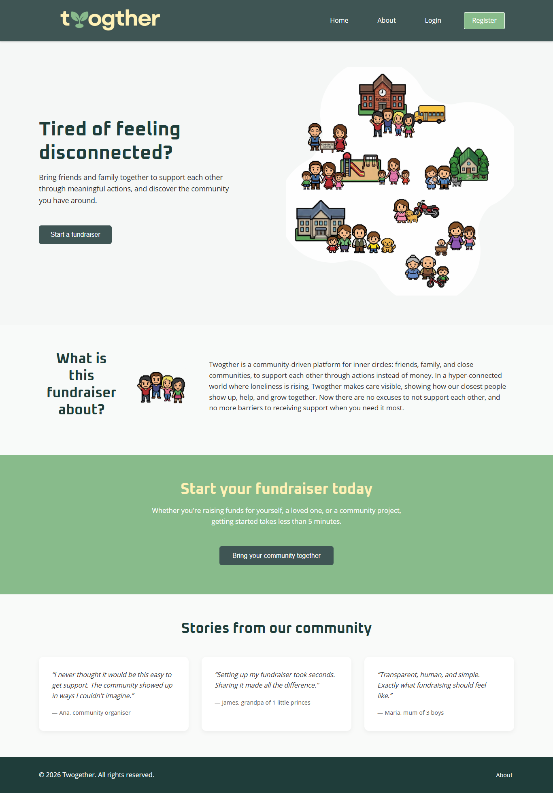
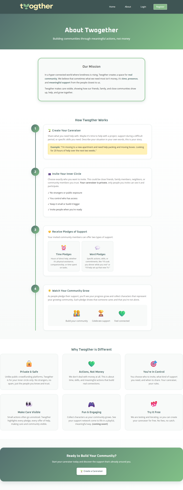
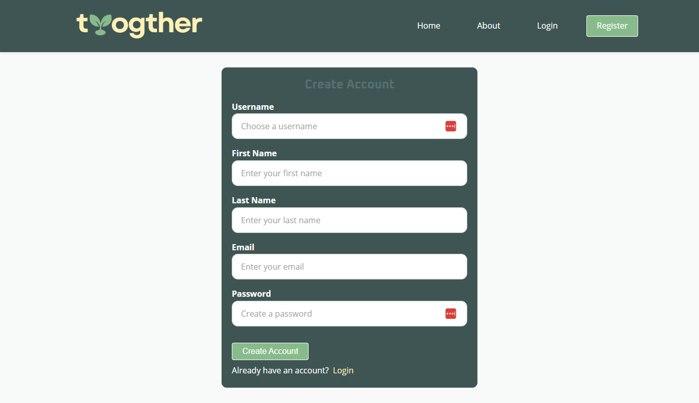
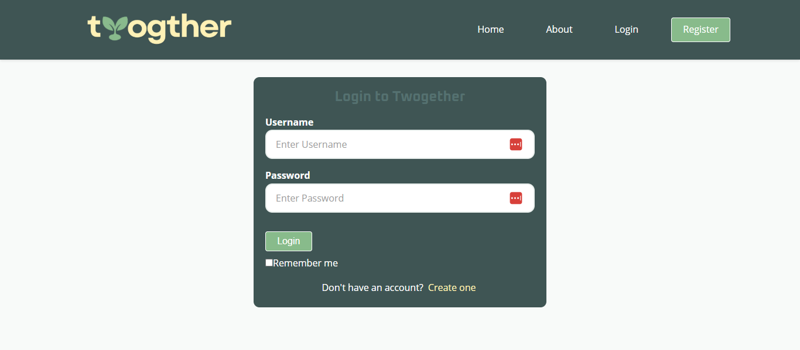
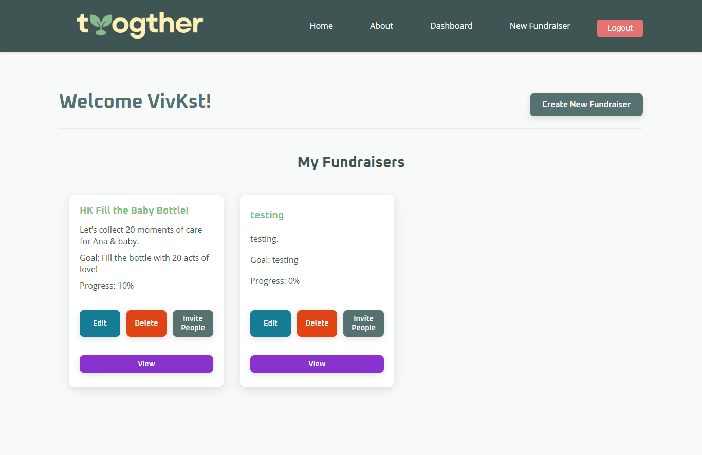
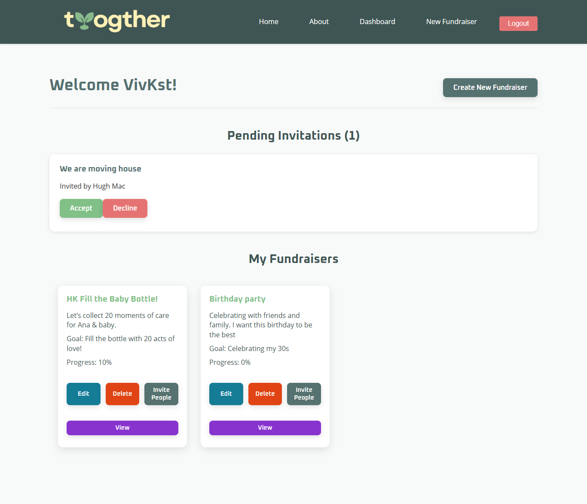
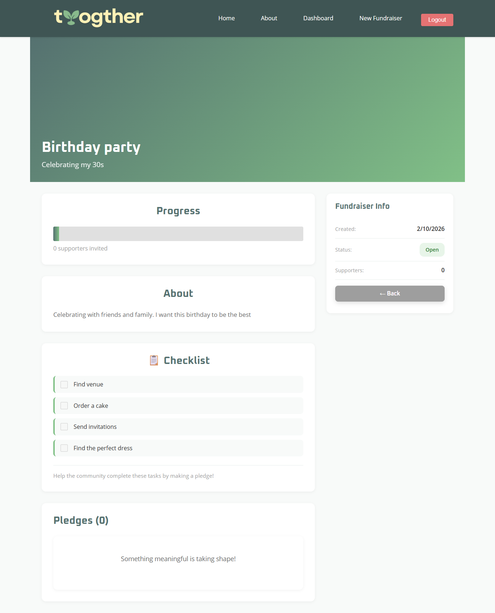

Together is a modern community-driven fundraiser platform where people support each other through meaningful actions.

Instead of just donating money, users contribute through intentional participation, engagement, and shared goals; building stronger communities around purpose.

---

## 🚀 About the Project

Together allows users to:

- Create fundraisers in seconds  
- Invite friends and family to join  
- Support each other through meaningful actions  
- Track progress and community engagement  
- Experience the power of collective support  

This project was built as a dynamic, app-like experience focused on simplicity, clarity, and emotional connection.

---

## 🛠 Tech Stack

Frontend:
- React
- CSS (responsive design)

Backend:
- Django
- Django REST Framework
- Token Authentication

Database:
- SQLite (development)

---

## Project Requirements

- [:white_check_mark:] Be separated into two distinct projects: an API built using the Django Rest Framework and a website built using React. 
- [:white_check_mark:] Have a cool name: it's name is Twogther
- [:white_check_mark:] Have a clear target audience: It's for communities, people feeling lonely, a platform for the AreUOk movement
- [:white_check_mark:] Have user accounts. A user should have at least the following attributes:
  - [:white_check_mark:] Username
  - [:white_check_mark:] Email address
  - [:white_check_mark:] Password
- [:white_check_mark:] Ability to create a “fundraiser” to be crowdfunded which will include at least the following attributes:
  - [:white_check_mark:] Title
  - [:white_check_mark:] Owner (a user)
  - [:white_check_mark:] Description
  - [:x:] Image: I started the development but it will stay to a next stage. People collect characters everytime they make a pledge. Some part is ready specially in styles. But it needs a bit more work
  - [:white_check_mark:] Target amount to raise
  - [:white_check_mark:] Whether it is currently open to accepting new supporters or not
  - [:white_check_mark:] When the fundraiser was created
- [:white_check_mark:] Ability to “pledge” to a fundraiser. A pledge should include at least the following attributes:
  - [:white_check_mark:] An amount
  - [:white_check_mark:] The fundraiser the pledge is for
  - [:white_check_mark:] The supporter/user (i.e. who created the pledge)
  - [:x:] Whether the pledge is anonymous or not: This is not possible, because to make a pledge you need to be invited by the fundraiser owner. The idea is to highlight who does the pledge not hide
  - [:white_check_mark:] A comment to go along with the pledge
- [:white_check_mark:] Implement suitable update/delete functionality, e.g. should a fundraiser owner be allowed to update its description?
- [:white_check_mark:] Implement suitable permissions, e.g. who is allowed to delete a pledge?
- [:white_check_mark:] Return the relevant status codes for both successful and unsuccessful requests to the API.
- [:x:] Handle failed requests gracefully (e.g. you should have a custom 404 page rather than the default error page): I didn't have time to do this before submission
- [:white_check_mark:] Use Token Authentication, including an endpoint to obtain a token along with the current user's details.
- [:white_check_mark:] Implement responsive design.

## Print Screens

<strong>Home</strong>

<strong>About</strong>

<strong>Create a new fundraiser form</strong>

<strong>Login form</strong>

<strong>Fundraisers & invitations</strong>

<strong>Dashboard</strong>

